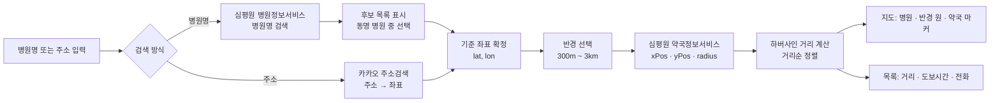
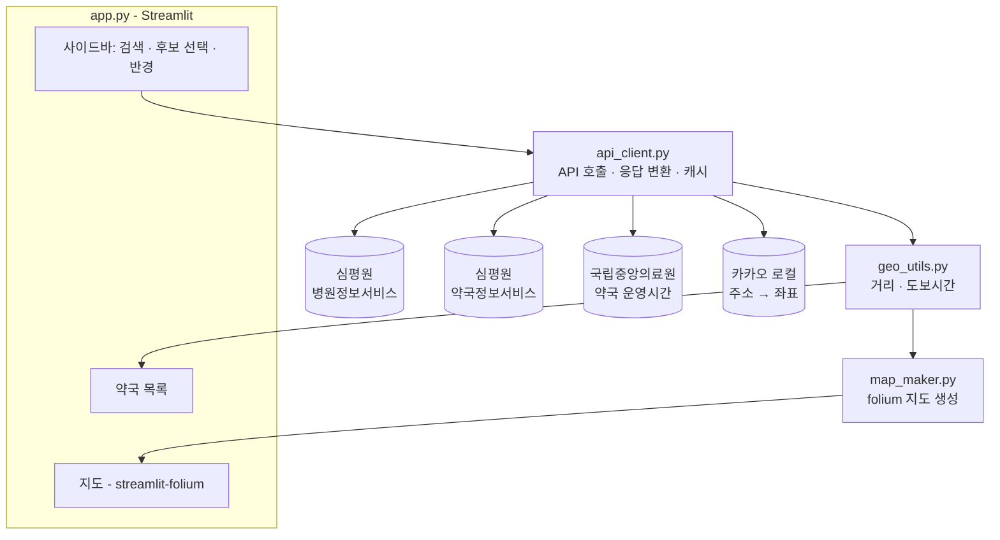

# 🏥💊 병원 근처 약국 찾기 — 프로그램 기획서

> 병원을 검색하면, 선택한 거리 안에 있는 약국을 위경도 기반으로 찾아 **지도 위에** 보여주는 프로그램

---

## 1. 개요

### 1.1 한 줄 정의
병원명(또는 주소)으로 병원을 찾고 → 반경(300m~3km)을 고르면 → 주변 약국을 지도에 마커로 표시하고 거리순 목록으로 보여준다.

### 1.2 해결하려는 문제
- 진료 후 처방전을 받았는데 **근처 약국이 어디 있는지** 모름
- 대형병원 앞 약국은 붐비므로 **조금 떨어진 약국**도 같이 보고 싶음
- 야간·주말 진료 후 **지금 문 연 약국**을 찾기 어려움 (2단계)

### 1.3 사용 시나리오
| # | 사용자 | 상황 | 기대 결과 |
|---|---|---|---|
| 1 | 환자 | "서울대학교병원" 진료 후 약국 찾기 | 반경 500m 약국이 지도·목록에 거리순 표시 |
| 2 | 보호자 | 처음 가는 병원, 주소만 알고 있음 | 주소 검색 → 그 위치 주변 약국 표시 (2단계) |
| 3 | 야간 진료 환자 | 밤 9시에 약국 찾기 | "지금 영업 중" 필터로 문 연 약국만 표시 (2단계) |

---

## 2. 사용자 흐름



---

## 3. 기능 정의

### 3.1 기능 목록 (우선순위)

| ID | 기능 | 설명 | 우선순위 |
|---|---|---|---|
| F1 | 병원 검색 | 병원명 부분일치 검색, 시/도 필터 | **P0 (MVP)** |
| F2 | 병원 후보 선택 | 동명 병원이 여러 개면 병원명·종별·주소 목록에서 선택 | **P0** |
| F3 | 반경 선택 | 300m / 500m / 1km / 2km / 3km (기본값 500m) | **P0** |
| F4 | 주변 약국 조회 | 병원 좌표 + 반경으로 약국 조회 | **P0** |
| F5 | 지도 표시 | 병원 마커(빨강), 반경 원, 약국 마커(초록), 클릭 시 팝업 | **P0** |
| F6 | 약국 목록 | 거리순 정렬, 거리·예상 도보시간·전화번호 표시 | **P0** |
| F7 | 주소로 검색 | 주소 → 좌표 변환 후 그 지점을 기준으로 약국 조회 | P1 |
| F8 | 운영시간 / 지금 영업 중 | 요일별 영업시간 표시, 현재 시각 기준 필터 | P1 |
| F9 | 길찾기 링크 | 약국별 카카오맵 길찾기 링크 제공 | P1 |
| F10 | 약칭 검색 보완 | "서울대병원"처럼 약칭 입력 시 카카오 키워드 검색으로 보완 | P1 |
| F11 | 내 위치 기준 검색 | 브라우저 위치(GPS)로 기준점 설정 | P2 |
| F12 | 야간·휴일 약국 필터 | 공휴일 영업시간(`dutyTime8`) 활용 | P2 |
| F13 | 최근 검색 / 즐겨찾기 | 자주 가는 병원 저장 | P2 |
| F14 | 도보 경로 거리 | 직선거리 대신 실제 보행 경로 거리 | P2 |

### 3.2 반경 선택 상세
- 선택지: `300m, 500m, 1km, 2km, 3km` (Streamlit `select_slider`)
- 반경을 바꾸면 지도 줌은 **반경 원이 화면에 꽉 차도록** 자동 조정 (`folium` `fit_bounds`)
- 예상 도보시간 = 거리(m) ÷ 67m/분 (시속 약 4km). 직선거리 기준이므로 화면에는 "도보 약 N분"으로 표기

---

## 4. 화면 설계

### 4.1 레이아웃 (기존 stock-monitor와 같은 사이드바 + 메인 구성)

```
[사이드바]                          [메인]
────────────────────────            ──────────────────────────────────────────────
🏥 병원 근처 약국 찾기               요약 카드:  선택 병원 | 반경 | 약국 수 | 가장 가까운 약국
                                    ──────────────────────────────────────────────
검색 방식  ◉ 병원명  ○ 주소          지도 (화면 폭의 약 2/3)       약국 목록 (거리순)
검색어    [서울대병원        ] 🔍                                  1. ○○약국   80m · 도보 약 1분
지역      [서울특별시 ▼] (선택)          ( 반경 원 )                  📞 02-000-0000  [길찾기]
                                           🏥                     2. △△약국  120m · 도보 약 2분
검색 결과 3건                          💊      💊                    📞 02-000-0000  [길찾기]
◉ 서울대학교병원 (상급종합)                  💊                    3. ...
○ 서울대학교치과병원 (치과병원)
○ ...                                마커 클릭 → 팝업
                                     (약국명 / 주소 / 거리 / 전화 / 영업시간)
반경  300m ──●──────── 3km
☐ 지금 영업 중인 약국만 (2단계)

ⓘ 공공데이터 기준 정보입니다.
  방문 전 전화로 확인하세요.
```

### 4.2 지도 표현 규칙
| 요소 | 표현 |
|---|---|
| 기준 병원 | 빨간색 병원 아이콘 마커, 팝업에 병원명·종별·주소·전화 |
| 검색 반경 | 반투명 파란 원 (`folium.Circle`, 반지름 = 선택 반경) |
| 약국 | 초록색 약국 아이콘 마커, 팝업에 약국명·주소·거리·전화·영업시간 |
| 가장 가까운 약국 | 마커 색 강조 (진한 초록) |
| 마커가 많이 겹칠 때 | `MarkerCluster` 적용 (대형병원 문전약국 밀집 지역 대비) |

---

## 5. 데이터 소스

### 5.1 사용할 API

| 용도 | 제공처 / 서비스 | 오퍼레이션 | 핵심 요청값 | 핵심 응답값 |
|---|---|---|---|---|
| 병원 검색 | [건강보험심사평가원 병원정보서비스](https://www.data.go.kr/data/15001698/openapi.do) | `hospInfoServicev2/getHospBasisList` | `yadmNm`(병원명), `sidoCd`, `clCd`(종별) | `yadmNm`, `clCdNm`, `addr`, `telno`, `XPos`, `YPos`, `ykiho` |
| 반경 약국 조회 | [건강보험심사평가원 약국정보서비스](https://www.data.go.kr/data/15001673/openapi.do) | `pharmacyInfoService/getParmacyBasisList` | `xPos`, `yPos`, `radius`(m) | `yadmNm`, `addr`, `telno`, `XPos`, `YPos`, `distance` |
| 약국 운영시간 (P1) | [국립중앙의료원 전국 약국 정보 조회 서비스](https://www.data.go.kr/data/15000576/openapi.do) | 약국 목록/위치 조회 | 지역·요일 또는 `WGS84_LON`, `WGS84_LAT` | `dutyName`, `dutyTime1s~8c`, `wgs84Lon`, `wgs84Lat` |
| 주소 → 좌표 (P1) | 카카오 로컬 API | 주소 검색 / 키워드 검색 | 주소 또는 키워드, `category_group_code=HP8`(병원) | `x`(경도), `y`(위도) |
| 대량 적재 (2단계) | [심평원 전국 병의원 및 약국 현황 (파일데이터)](https://www.data.go.kr/data/15051059/fileData.do) | 분기별 파일 다운로드 | — | 전국 병원·약국 목록 + 좌표 |

> 오퍼레이션명·파라미터는 개발 착수 시 공공데이터포털의 최신 명세(Swagger)에서 한 번 더 확인한다.

### 5.2 반드시 주의할 점
1. **좌표 순서가 API마다 다르다** — 가장 흔한 버그 원인
   - 심평원: `XPos` = **경도(lon)**, `YPos` = **위도(lat)**
   - 카카오: `x` = **경도**, `y` = **위도**
   - folium: `[위도, 경도]` 순서
   - → API 응답을 받는 즉시 `lat` / `lon` 이름의 필드로 변환하고, 그 뒤로는 `x`/`y`를 쓰지 않는다.
2. **공공데이터포털 인증키 인코딩** — `requests`의 `params`로 넘길 때는 **Decoding 키**를 사용한다. Encoding 키를 넣으면 이중 인코딩돼 `SERVICE_KEY_IS_NOT_REGISTERED_ERROR`가 난다.
3. **응답 형식** — 기본은 XML이며 JSON 지원 여부가 API마다 다르다. XML 파싱을 기본으로 구현한다.
4. **병원명 검색은 공식 명칭 부분일치** — "서울대병원"으로는 "서울대학교병원"이 안 나올 수 있다. MVP는 안내 문구로 대응하고, P1에서 카카오 키워드 검색(F10)으로 보완한다.
5. **호출 한도** — 개발계정은 일일 호출 수 제한이 있다. `st.cache_data(ttl=...)`로 같은 검색은 캐시에서 응답한다.
6. **심평원과 국립중앙의료원은 기관 ID 체계가 다르다** (`ykiho` ↔ `hpid`). 운영시간을 붙일 때는 *약국명 정규화 + 좌표 50m 이내*로 매칭한다. 2단계 착수 시 국립중앙의료원 위치 기반 조회만으로 반경 필터와 운영시간을 함께 해결할 수 있는지 먼저 검증하고, 가능하면 약국 데이터 출처를 하나로 통일한다.

---

## 6. 시스템 구성

### 6.1 기술 스택 (추천)

| 영역 | 선택 | 이유 |
|---|---|---|
| 언어 / UI | Python 3.11+, **Streamlit** | 기존 stock-monitor와 같은 스택이라 바로 시작 가능 |
| 지도 | **folium + streamlit-folium** (OpenStreetMap 타일) | API 키 없이 사용 가능, 원·마커·팝업·클러스터를 Python만으로 구현 |
| HTTP / 재시도 | `requests`, `tenacity` | 이미 requirements에 있음 |
| XML 파싱 | `xml.etree.ElementTree` (표준 라이브러리) | 추가 의존성 없음 |
| 캐시 | `st.cache_data(ttl=3600)` | API 호출 수 절감 |
| 2단계 저장소 | SQLite | 파일데이터를 적재해 API 장애·한도 대비 |

**카카오맵(JavaScript)을 MVP에서 쓰지 않는 이유:** JS 키 발급과 도메인 등록이 필요하고, Streamlit에서는 `components.html`로 넣어야 해서 "마커 클릭 → 목록 연동" 같은 Python ↔ JS 상호작용이 번거롭다. 한국 지도 품질이 중요해지면 3단계에서 전환을 검토한다.

### 6.2 구조



### 6.3 폴더 구조
기존 저장소의 `data_collector.py` / `chart_maker.py` / `stock_analyzer.py` 패턴을 그대로 따른다.

```
pharmacy_finder/
├── PLAN.md                        # 이 문서
├── app.py                         # Streamlit 화면 (사이드바 검색 + 지도 + 목록)
├── api_client.py                  # 병원/약국/주소 API 호출, XML → 모델 변환
├── geo_utils.py                   # 하버사인 거리, 도보시간, 반경 필터
├── map_maker.py                   # folium 지도 생성 (마커, 반경 원, 팝업, 클러스터)
├── models.py                      # Hospital, Pharmacy 데이터 클래스
├── demo_data.py                   # 인증키 없이 화면을 확인하는 데모 데이터
├── requirements.txt               # streamlit, folium, streamlit-folium, requests, tenacity
├── .streamlit/
│   └── secrets.toml.example       # API 키 템플릿 (실제 secrets.toml은 .gitignore)
└── tests/
    ├── test_geo_utils.py          # 거리 계산 검증
    ├── test_api_client.py         # 샘플 XML 응답 파싱 검증
    └── test_map_maker.py          # 지도 마커·이스케이프 검증
```

### 6.4 데이터 모델

```python
from dataclasses import dataclass, field

@dataclass
class Hospital:
    id: str            # 심평원 암호화 요양기호(ykiho)
    name: str          # 병원명
    kind: str          # 종별: 상급종합병원 / 종합병원 / 병원 / 의원 ...
    address: str
    tel: str
    lat: float         # 위도 (심평원 YPos)
    lon: float         # 경도 (심평원 XPos)

@dataclass
class Pharmacy:
    id: str
    name: str
    address: str
    tel: str
    lat: float
    lon: float
    distance_m: float = 0.0                       # 기준 병원과의 직선거리
    hours: dict[int, tuple[str, str]] = field(default_factory=dict)
    # 요일(1=월 ~ 7=일, 8=공휴일) → ("0900", "1800")  ※ P1

    @property
    def walk_minutes(self) -> int:
        return max(1, round(self.distance_m / 67))
```

### 6.5 핵심 로직

**① 거리 계산 (하버사인)**
```python
from math import radians, sin, cos, asin, sqrt

EARTH_RADIUS_M = 6_371_000

def haversine_m(lat1: float, lon1: float, lat2: float, lon2: float) -> float:
    dlat = radians(lat2 - lat1)
    dlon = radians(lon2 - lon1)
    a = sin(dlat / 2) ** 2 + cos(radians(lat1)) * cos(radians(lat2)) * sin(dlon / 2) ** 2
    return 2 * EARTH_RADIUS_M * asin(sqrt(a))
```

**② 주변 약국 조회 순서**
1. 병원 좌표(`lat`, `lon`)와 반경(m)으로 약국 API 호출 (`xPos=lon`, `yPos=lat`, `radius=반경`)
2. `totalCount`가 한 페이지보다 많으면 다음 페이지까지 조회
3. 좌표가 없는 약국은 제외
4. 하버사인으로 거리를 **직접 다시 계산**해 반경 밖은 제외 (출처가 달라도 같은 기준으로 거리 표시)
5. 거리순 정렬 → 지도와 목록에 같은 순번으로 표시

**③ "지금 영업 중" 판단 (P1)**
- 오늘 요일 코드(공휴일이면 8) → `hours[요일]`의 시작~종료 사이에 현재 시각이 있으면 영업 중
- 종료 시각이 자정을 넘는 경우(종료 < 시작, 또는 `2400` 이상 표기)도 처리

---

## 7. 예외 처리

| 상황 | 처리 |
|---|---|
| 병원 검색 결과 0건 | "검색 결과가 없습니다. 공식 명칭 일부로 검색해 보세요 (예: 서울대병원 → 서울대학교)" 안내 |
| 동명 병원 여러 건 | 병원명 + 종별 + 주소를 함께 보여주고 선택, 시/도 필터 제공 |
| 반경 내 약국 0곳 | "반경 N m 안에 약국이 없습니다" + [반경 넓히기] 버튼 (다음 단계 반경으로 재조회) |
| 좌표 누락 기관 | 결과에서 제외 |
| API 오류 / 타임아웃 | `tenacity`로 1회 재시도 후 오류 메시지 표시. 인증키 오류는 "API 키 확인" 안내로 구분 |
| 마커 과밀 (문전약국) | `MarkerCluster` 적용 |
| 휴·폐업 반영 지연 | 화면 하단에 "공공데이터 기준, 방문 전 전화 확인" 문구 상시 표시 |

---

## 8. 비기능 요구사항

| 항목 | 목표 |
|---|---|
| 응답 속도 | 검색 → 지도 표시 3초 이내, 캐시 적중 시 1초 이내 |
| API 사용량 | 같은 검색어·좌표·반경은 1시간 캐시 |
| 보안 | API 키는 `.streamlit/secrets.toml`에 저장, 저장소에 커밋 금지 (`.gitignore`) |
| 화면 | 데스크톱 우선, 모바일 폭에서는 지도 → 목록 세로 배치 |
| 테스트 | 거리 계산·XML 파싱은 네트워크 없이 단위 테스트 (샘플 응답 파일 사용) |

---

## 9. 개발 단계

### 1단계 — MVP (P0: F1~F6)
- [x] 공공데이터포털 API 활용신청 (심평원 병원정보서비스, 심평원 약국정보서비스), 키 발급
- [x] 발급받은 키로 두 API 실제 응답 확인 (필드명이 `api_client.py` 파싱과 맞는지)
- [x] `models.py`, `api_client.py` (검색 + XML 파싱 + 캐시), 키가 없을 때의 데모 모드
- [x] `geo_utils.py` + `test_geo_utils.py`
- [x] `map_maker.py` (병원 마커, 반경 원, 약국 마커, 팝업, `fit_bounds`)
- [x] `app.py` 화면 연결 (사이드바 → 요약 카드 → 지도 + 목록)
- [x] 예외 처리, 면책 문구

**완료 기준:** "서울대학교병원" 검색 → 선택 → 반경 500m → 지도에 약국 마커와 거리순 목록이 표시된다.

### 2단계 — 편의 기능 (P1: F7~F10)
- [ ] 카카오 REST API 키 발급 → 주소 검색(F7), 약칭 검색 보완(F10)
- [ ] 국립중앙의료원 약국 API 연동 → 운영시간 표시, "지금 영업 중" 필터(F8)
- [ ] 약국별 카카오맵 길찾기 링크(F9)
- [ ] 심평원 파일데이터 → SQLite 적재, API 장애 시 로컬 DB로 대체 조회

### 3단계 — 확장 (P2: F11~F14)
- [ ] 내 위치 기준 검색, 야간·휴일 필터, 즐겨찾기
- [ ] 도보 경로 거리 (보행자 경로 API 검토)
- [ ] 배포 (Streamlit Community Cloud 등), 필요 시 카카오맵 JS로 지도 교체

---

## 10. 사전 준비물

| 준비물 | 어디서 | 필요 시점 |
|---|---|---|
| 공공데이터포털 인증키 | data.go.kr 회원가입 → 각 API "활용신청" (승인 후 키가 동작하기까지 시간이 걸릴 수 있음) | 1단계 |
| 카카오 REST API 키 | Kakao Developers → 애플리케이션 추가 | 2단계 |
| Python 패키지 | `pip install streamlit folium streamlit-folium requests tenacity` | 1단계 |

---

## 11. 결정이 필요한 사항 (기본값으로 진행 가능)

| # | 질문 | 기본값 (추천) | 다른 선택지 |
|---|---|---|---|
| 1 | 누가 쓰나? | 개인·내부용 → **Streamlit** | 일반 공개 모바일 서비스 → FastAPI + 카카오맵 웹 |
| 2 | 지도는? | **folium (OpenStreetMap)** — 키 불필요 | 카카오맵 JS — 한국 지도 품질 우수, 키·도메인 등록 필요 |
| 3 | 병원 검색 범위 | **의원 포함 전체** + 종별 필터 | 병원급 이상만 |
| 4 | 코드 위치 | **이 저장소의 `pharmacy_finder/` 폴더** | 별도 저장소로 분리 |
